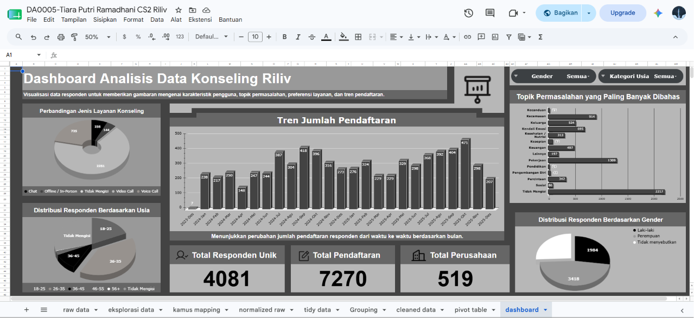

# 🧠 Counselling Registration Analytics Pipeline

Transformasi data pendaftaran layanan konseling dari format semi-terstruktur menjadi dataset yang bersih, terstandarisasi, dan siap digunakan untuk analisis maupun dashboard reporting.

---

## 📌 Gambaran Project

Project ini merupakan implementasi end-to-end proses data preparation menggunakan Microsoft Excel dan Google Sheets berdasarkan studi kasus Data Analyst.

Dataset awal berasal dari hasil ekspor formulir pendaftaran layanan konseling perusahaan yang memiliki struktur **Question / Response**.

Permasalahan utamanya adalah setiap responden dapat memiliki urutan pertanyaan yang berbeda, variasi penulisan label pertanyaan, hingga kombinasi Bahasa Indonesia dan Bahasa Inggris, sehingga data tidak dapat langsung digunakan untuk analisis.

Project ini bertujuan mengubah data tersebut menjadi **analytics-ready dataset** melalui proses eksplorasi, pemetaan, transformasi, standarisasi, hingga visualisasi dashboard.

---

# 🎯 Tujuan

- Mengidentifikasi seluruh variasi label pertanyaan
- Membuat kamus mapping untuk standarisasi label
- Melakukan transformasi data dari format Wide menjadi Tidy
- Membersihkan dan menyeragamkan nilai data
- Menyiapkan dataset siap analisis
- Membangun dashboard sebagai visualisasi insight

---

# 📂 Struktur Repository

```
.
├── assets/
├── data/
│   ├── raw/
│   └── cleaned/
├── workbook/
├── README.md
└── LICENSE
```

---

# ⚙️ Workflow Project

```
📥 Raw Dataset
        │
        ▼
🔍 Data Exploration
        │
        ▼
🗂 Mapping Dictionary
        │
        ▼
🔄 Data Normalization
        │
        ▼
📋 Tidy Transformation
        │
        ▼
🧩 Data Standardization & Categorization
        │
        ▼
✨ Clean Dataset
        │
        ▼
📊 Pivot Tables
        │
        ▼
📈 Dashboard & Insights
```

---

# 📖 Penjelasan Setiap Tahapan

## 1. Raw Dataset

Menggunakan dataset mentah hasil ekspor formulir registrasi konseling.

Karakteristik data:

- 7.270 data pendaftaran
- Struktur Question & Response
- Label pertanyaan tidak konsisten
- Campuran Bahasa Indonesia dan Bahasa Inggris
- Banyak nilai kosong (missing value)

---

## 2. Data Exploration

Melakukan eksplorasi seluruh kolom Question 1–10 untuk mengidentifikasi seluruh variasi label pertanyaan yang muncul.

Tahap ini menghasilkan daftar label unik yang menjadi dasar proses standarisasi.

---

## 3. Mapping Dictionary

Menyusun kamus mapping untuk mengelompokkan berbagai variasi label pertanyaan menjadi satu kategori standar.

Contoh:

| Label Asli | Standarisasi |
|------------|--------------|
| Company Code | Perusahaan |
| Nama Perusahaan | Perusahaan |
| Business Entity | Perusahaan |
| Kode Perusahaan | Perusahaan |

Pendekatan yang sama diterapkan pada seluruh label pertanyaan lainnya.

---

## 4. Data Normalization

Mengubah struktur data dari format:

```
Question 1
Response 1

Question 2
Response 2
...
```

menjadi format yang lebih mudah diproses sehingga setiap pasangan Question–Response berada dalam satu baris.

Tahapan ini mempermudah proses transformasi berikutnya.

---

## 5. Tidy Transformation

Melakukan transformasi sehingga:

- setiap baris mewakili satu pendaftaran
- setiap kolom mewakili satu atribut

Hasil akhirnya mengikuti prinsip **Tidy Data** sehingga siap digunakan untuk analisis.

---

## 6. Data Standardization & Categorization

Melakukan standarisasi berbagai nilai agar lebih konsisten.

Contoh proses yang dilakukan:

- standardisasi gender
- standardisasi perusahaan
- standardisasi divisi
- pengelompokan kategori usia
- standarisasi layanan konseling
- standarisasi informed consent
- penanganan missing value
- penyederhanaan kategori untuk dashboard

Tahapan ini bertujuan meningkatkan kualitas data sekaligus mempermudah proses visualisasi.

---

## 7. Clean Dataset

Menghasilkan dataset akhir yang telah:

- bersih
- konsisten
- mudah dibaca
- siap digunakan untuk analisis lanjutan
- siap digunakan pada dashboard

Dataset akhir tersedia pada folder:

```
data/cleaned/
```

---

## 8. Dashboard

Dataset akhir kemudian digunakan untuk membangun dashboard menggunakan Pivot Table dan Chart di Microsoft Excel.

Dashboard menampilkan beberapa insight utama seperti:

- Jumlah pendaftaran per perusahaan
- Distribusi usia responden
- Distribusi gender responden
- Topik permasalahan yang paling sering dibahas
- Perbandingan jenis layanan konseling
- Tren jumlah pendaftaran

---

# 🖼 Dashboard Preview

<p align="center">

</p>

---

# 📁 Workbook

Seluruh proses pengerjaan terdokumentasi dalam satu workbook sehingga setiap tahapan dapat ditelusuri secara berurutan.

Workbook terdiri dari beberapa sheet:

| Sheet | Deskripsi |
|--------|-----------|
| Raw Data | Dataset mentah |
| Eksplorasi Data | Identifikasi variasi label pertanyaan |
| Kamus Mapping | Standarisasi label pertanyaan |
| Normalized Raw | Transformasi awal Question–Response |
| Tidy Data | Dataset hasil transformasi |
| Grouping | Standarisasi kategori |
| Cleaned Data | Dataset final |
| Pivot Table | Agregasi data |
| Dashboard | Visualisasi |

Workbook dapat diakses pada:

```
workbook/
```

---

# 🛠 Tools

- Google Sheets
- Microsoft Excel
- Pivot Table
- Formula
- QUERY
- FILTER
- UNIQUE

---

# 💡 Kompetensi yang Ditunjukkan

Project ini menunjukkan kemampuan pada beberapa area berikut:

### 📊 Data Analysis

- Exploratory Data Analysis
- Dashboard Reporting
- Data Visualization
- Business Insight

### ⚙️ Data Engineering

- Data Cleaning
- Data Transformation
- Data Normalization
- Data Standardization
- ETL Workflow
- Analytics-ready Dataset

### 📈 Business Intelligence

- Dashboard Development
- KPI Reporting
- Pivot Table Analysis

---

# 🚀 Hasil

Melalui project ini, data pendaftaran konseling yang awalnya berbentuk semi-terstruktur berhasil ditransformasikan menjadi dataset yang rapi, konsisten, dan siap digunakan untuk proses analisis maupun pelaporan.

Selain menghasilkan dashboard, project ini juga mendokumentasikan seluruh proses transformasi data secara end-to-end sehingga setiap tahapan dapat ditelusuri kembali dengan mudah.
